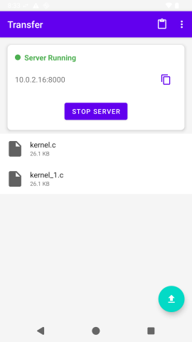
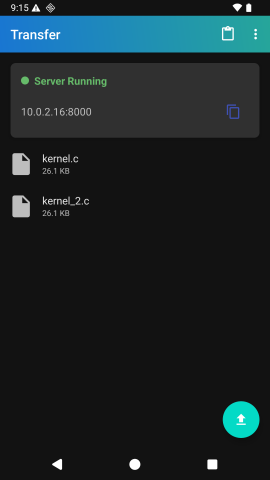
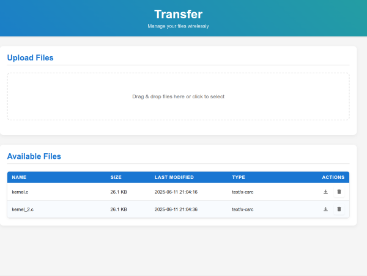

# Transfer

A simple local file server app for Android. Download and upload files quickly across devices over Wi-Fi — no cables, no cloud.

Transfer makes sharing files across your local network incredibly straightforward. Think of it as a temporary USB stick you can access from any computer or device with a web browser — but without the physical stick, powered by a clean and simple UI.

Basically, a better alternative to running `uploadserver` through Termux.

## The Problem It Solves

Imagine you need to transfer a file between your laptop and desktop — but you just want to send the file and move on:

* You don’t have a USB stick or cable handy
* You don’t want to configure SMB (enable/run Samba, then download a client)
* You don’t want to use the cloud — either because it’s slow, unprivate, or you simply don’t have easy access to it

## Key Features

* **Effortless LAN Sharing**: Once Transfer is active, it serves files from your chosen shared folder over HTTP. Any device on the same Wi-Fi can connect using a simple web address shown in the app.
* **Configurable Security**:
    * **IP Permissions**: By default, new devices attempting to connect trigger an "Allow/Deny" popup on your phone, giving you control over who accesses your files. This can be turned off for trusted networks.
    * **Password Protection**: For an added layer, you can secure access with a password (off by default).
* **Powerful CLI Access (curl-friendly)**:
    * Transfer works great with command-line tools. Upload files directly using `curl -T yourfile.txt <your-phone-ip>:8000`.Also,you can download files using`curl <phone-ip>:8000/yourfile.txt`.
* **Dual Browse UI**: Manage and access your shared files directly within the Transfer app on your Android device, or through the intuitive web interface on any connected computer.
* **Quick In-App Transfers**:
    * **Upload**: Easily select files from your phone’s storage to add them to the shared folder.
    * **Paste**: Paste text from your phone’s clipboard directly into a new `.txt` file in the shared folder with a single tap.

## How to get the app
Recommended way:
from [IzzyOnDroid](https://apt.izzysoft.de/fdroid/index/apk/com.matanh.transfer) (use an F-Droid client like Neo Store, Droid-ify, or add IzzyOnDroid repo.)

  

Directly from [github releases](https://github.com/matan-h/Transfer/releases) (You can also point Obtainium to this link.)

## Getting Started

1. Install and open Transfer on your Android device.
2. Grant necessary permissions and select a folder you wish to share (suggestion: create a new folder called `Storage` in your home directory).
3. Tap "Start Server."
4. The app will display an IP address (e.g., `http://192.168.1.X:8000`).
5. Open this address in a web browser on any other device connected to the same Wi-Fi network.
6. You're in! If IP permissions are on (default), you'll get a prompt on your phone to allow the new device.

It's designed to be that simple. Enjoy your new wireless drive.

## FAQ
### Can I set a specific IP address to use every time?
Yes, you can set a [static IP](https://junipersys.com/support/article/14695) on your Android device.

[asked here](https://www.reddit.com/r/fossdroid/comments/1l3yi6m/comment/mw9t8lt)

### Can I use Transfer without an internet connection?
Yes, Transfer works over your local Wi-Fi network, so an internet connection is not required. However, all devices must be connected to the same local network.

### What happens to files I share/upload to the Transfer
Transfer copy the files to the shared folder you set earlier.   

### Do you have good UI?
Dark mode (available in light and dark):

Web interface (available in light and dark):

## Planned changes
[ ] add an option to change the port in the settings
[ ] fallback to hotspot IP in the display. 
[ ] automatically update the IP when Wifi changes 

## Contributing

Any contributions, bugs, or feedback are welcome!
Feel free to open an issue or PR.

## License
this repo is Licensed under the MIT license.