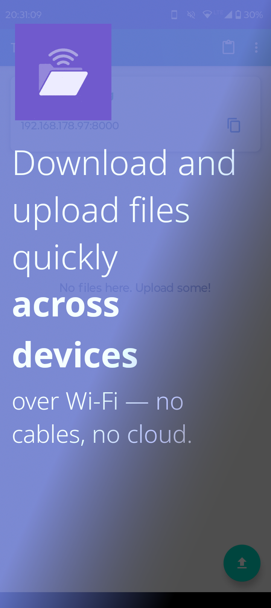
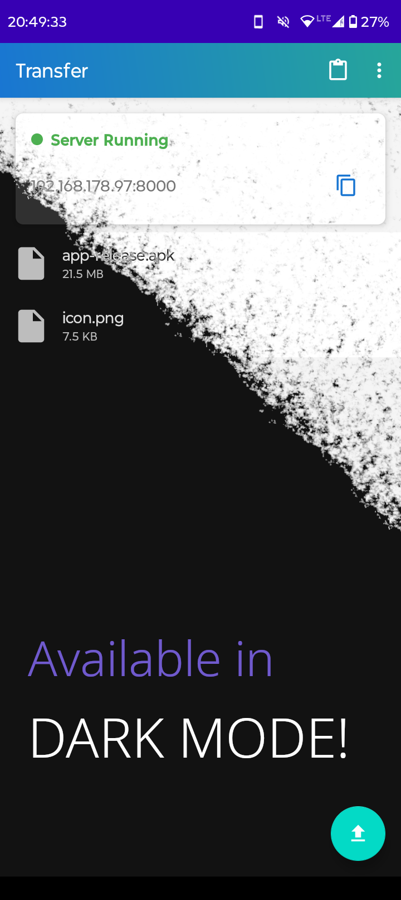
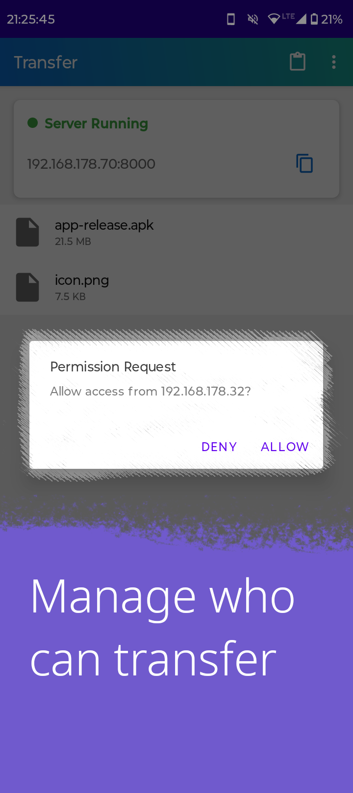

<h1 align="center">Transfer</h1>

  
  
  

<strong>A simple local file server for Android</strong>

  Transfer files instantly across devices over Wi-Fi – no cables, no cloud, no hassle.

## Screenshots

  
  
  
  
  
  

## Features

- **One-tap server**: Start HTTP server instantly  
- **Cross-platform**: Access from any device with a web browser  
- **Secure**: Device permissions and optional password protection  
- **CLI-friendly**: Works with `curl` and command-line tools  
- **No internet required**: Works over local Wi-Fi only  

## Installation

**Recommended:**
- [IzzyOnDroid](https://apt.izzysoft.de/fdroid/index/apk/com.matanh.transfer) (F-Droid)
- [Google Play Store](https://play.google.com/store/apps/details?id=com.matanh.transfer)

**Alternative:**
- [GitHub Releases](https://github.com/matan-h/Transfer/releases)

## Quick Start

1. Install Transfer and select a folder to share  
2. Tap "Start Server"  
3. Open the displayed IP address in any browser on the same Wi-Fi  
4. Allow access when prompted  

## Usage

1. Upload file(s)  
2. Download file(s)  
   - Both in the app and the web interface.  

## FAQ

**Browser shows SSL errors?** Use `http://` not `https://`  
**Need consistent IP?** Set up a [static IP](https://junipersys.com/support/article/14695) on your device  
**Files location?** Uploaded files go to your selected shared folder  

## Contributing

Check [CONTRIBUTING.md](CONTRIBUTING.md) for guidelines. Issues and PRs welcome!

## License

MIT License – see [LICENSE](LICENSE) file.
